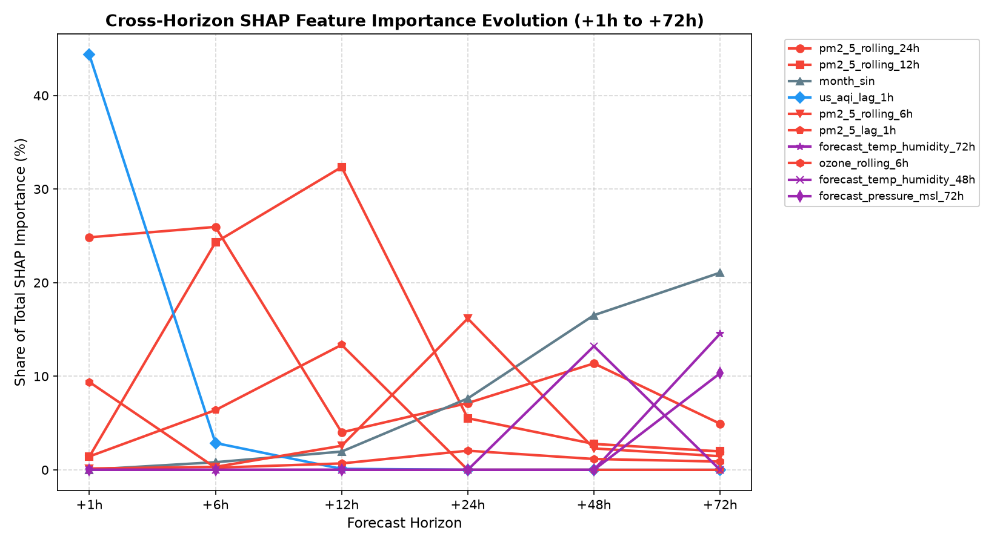

# Pearls AQI Predictor 🌍💨

> **Serverless Multi-Horizon Air Quality Forecasting System for Karachi, Pakistan**  
> Direct multi-horizon machine learning (+1h to +72h), leakage-free feature engineering, cloud feature store, automated retrain-and-deploy CI/CD, and multi-horizon SHAP explainability.

[](https://www.python.org/)
[](https://fastapi.tiangolo.com/)
[](https://react.dev/)
[](https://www.typescriptlang.org/)
[](https://vitejs.dev/)
[](https://tailwindcss.com/)
[](https://www.hopsworks.ai/)
[](https://github.com/features/actions)
[](LICENSE)

---

## 📑 Table of Contents

- [Overview](#-overview)
- [System Architecture](#-system-architecture)
- [Key Innovations](#-key-innovations)
- [Model Performance Benchmark](#-model-performance-benchmark)
- [SHAP Explainability & Physical Insights](#-shap-explainability--physical-insights)
- [Repository Structure](#-repository-structure)
- [Local Setup & Development](#-local-setup--development)
- [API Reference](#-api-reference)
- [CI/CD & Automation](#-cicd--automation)
- [Technical Report](#-technical-report)
- [License](#-license)

---

## 🔍 Overview

**Pearls AQI Predictor** provides real-time and 72-hour air quality index forecasting for Karachi, an arid coastal megacity facing chronic particulate pollution burdens (historical mean AQI $\approx 88$).

Rather than relying on naive persistence heuristics or error-accumulating recursive step predictions, the system deploys **six autonomous, horizon-specialized gradient-boosted models** (+1h, +6h, +12h, +24h, +48h, and +72h). By incorporating future numerical weather forecasts, cyclical trigonometric seasonal encodings, and strict target leakage prevention, the forecaster delivers reliable public health intelligence with zero fixed hosting costs.

- **Live Backend API**: [`https://aqi-predictor-ed96dd41.fastapicloud.dev`](https://aqi-predictor-ed96dd41.fastapicloud.dev)
- **API Documentation**: [`/docs`](https://aqi-predictor-ed96dd41.fastapicloud.dev/docs) (Swagger UI)
- **Interactive Dashboard**: Deployed on Vercel with real-time EPA categorization, interactive charts, and multi-horizon SHAP inspection.

---

## 🏗 System Architecture

```mermaid
flowchart TD
    subgraph Data Layer ["Data Ingestion"]
        OM[Open-Meteo API<br/>Weather + AQI Observations + 3-Day Forecasts]
    end

    subgraph Feature Store Layer ["Hopsworks Cloud"]
        FP[Feature Pipeline<br/>Hourly Cron: 0 * * * *] -->|Engineered Features| FG[Hopsworks Feature Group<br/>aqi_features v2 (Hudi)]
    end

    subgraph Modeling Layer ["Training & Explainability"]
        TP[Training Pipeline<br/>Daily Cron: 0 2 * * *] -->|Pull 3y Dataset| FG
        TP -->|Train Direct Models| MD[XGBoost / RF / LSTM<br/>+1h, +6h, +12h, +24h, +48h, +72h]
        MD --> AR[Model Artifacts<br/>artifacts/models/]
        SH[SHAP Pipeline<br/>Staleness-Aware Refresh] -->|Explainability Plots & JSON| RP[Reports Directory<br/>reports/]
    end

    subgraph CI_CD ["Automation (GitHub Actions)"]
        GA[GitHub Actions Runner] --> FP
        GA --> TP
        TP -->|git commit & push| GH[GitHub Repository]
    end

    subgraph Serving Layer ["Inference & Production"]
        GH -->|Auto Rebuild| FC[FastAPI Cloud Backend<br/>REST API with 5-min TTL Cache]
        FC --> FE[React + TypeScript Dashboard<br/>Vercel Frontend]
    end

    OM --> FP
```

---

## 💡 Key Innovations

1. **Direct Multi-Horizon Strategy**:
   - Eliminates compounding autoregressive errors by training dedicated estimators for $+1\text{h}$, $+6\text{h}$, $+12\text{h}$, $+24\text{h}$, $+48\text{h}$, and $+72\text{h}$.
   - Hourly linear interpolation provides seamless hour-by-hour continuous forecasting.
2. **Leakage-Free Feature Engineering**:
   - Because the US AQI is a deterministic piecewise formula of current pollutant concentrations, **all instantaneous raw pollutant columns ($PM_{2.5}, PM_{10}, O_3, NO_2, SO_2, CO$) are dropped**.
   - Preserves historical air mass trajectory through lagged values ($t-1, t-24$) and rolling statistics (6h, 12h, 24h) without future information leakage.
3. **Forecast Weather & Meteorological Deltas**:
   - Integrates future weather predictions ($\mathbf{w}_{t+h}$) and meteorological differentials ($\Delta \mathbf{w}_h = \mathbf{w}_{t+h} - \mathbf{w}_t$) directly into the feature matrices.
   - Supplies the models with anticipated wind shifts, sea-breeze dispersion, and humidity variations.
4. **Horizon-Specific Feature Pruning**:
   - Prunes decaying short-term lags ($t-1, t-3$) from extended horizons ($\ge 24\text{h}$), anchoring multi-day predictions on diurnal cycles and synoptic weather.
5. **Automated Staleness Detection for Explainability**:
   - The SHAP pipeline automatically cross-references output JSON/PNG timestamps against model binary modification dates (`xgboost_{h}h/model.pkl`), ensuring CI/CD runs only recompute explanations when models have updated.

---

## 📊 Model Performance Benchmark

Models were trained and evaluated on 3 years of historical hourly observations (26,496 rows) with a strict chronological split: **70% Train** (18,547 rows), **15% Validation** (3,974 rows), and **15% Test** (3,975 rows).

| Horizon | Model | RMSE | MAE | $R^2$ Score | Operational Status |
| :--- | :--- | :---: | :---: | :---: | :--- |
| **+1h** | **XGBoost**<br/>Random Forest<br/>LSTM | **0.92**<br/>1.12<br/>1.73 | **0.46**<br/>0.48<br/>0.82 | **0.995**<br/>0.993<br/>0.984 | Near-perfect persistence; negligible error. |
| **+6h** | **XGBoost**<br/>Random Forest<br/>LSTM | **3.94**<br/>4.74<br/>4.89 | **2.03**<br/>2.28<br/>2.50 | **0.914**<br/>0.876<br/>0.869 | Exceptional fidelity for same-day public advisories. |
| **+12h** | **XGBoost**<br/>Random Forest<br/>LSTM | **6.34**<br/>6.76<br/>7.05 | **3.57**<br/>3.78<br/>4.09 | **0.778**<br/>0.748<br/>0.728 | Captures commute shifts and boundary layer collapse. |
| **+24h** | **XGBoost**<br/>Random Forest<br/>LSTM | **9.41**<br/>9.61<br/>9.82 | **6.25**<br/>6.38<br/>6.69 | **0.511**<br/>0.490<br/>0.472 | Reliable tracking of full diurnal peak-trough cycles. |
| **+48h** | **XGBoost**<br/>Random Forest<br/>LSTM | **12.07**<br/>12.28<br/>14.26 | **8.29**<br/>8.49<br/>9.83 | **0.200**<br/>0.172<br/>$-0.136$ | Directional signal driven by synoptic pressure/wind. |
| **+72h** | **XGBoost**<br/>Random Forest<br/>LSTM | **12.60**<br/>13.25<br/>13.00 | **8.90**<br/>9.25<br/>9.09 | **0.131**<br/>0.040<br/>0.042 | Converges gracefully to seasonal climatological mean. |

> **Key Takeaway**: XGBoost consistently won across all 6 horizons. Gradient boosted trees delivered superior tabular sample efficiency and lower inference latency ($\sim$2ms) compared to deep recurrent networks (LSTM).

---

## 🔬 SHAP Explainability & Physical Insights

SHAP TreeExplainer reveals an authentic **atmospheric phase transition**:
- **Short-Term (+1h, +6h)**: Dominated by ground-level inertia (`us_aqi_lag_1h` = 9.85) and rolling particulate concentration. Lags account for **84.1%** of total importance.
- **Diurnal (+24h)**: Driven by diurnal particulate baselines (`pm2_5_rolling_6h` = 5.26), seasonal cycles (`month_sin` = 2.48), and forecasted meteorological indices (`forecast_temp_humidity_24h` = 2.00).
- **Multi-Day (+48h, +72h)**: Autoregressive lags decay to **2.0%** importance, while numerical weather forecasts (pressure, wind vectors, temperature-humidity index) surge to **44.1%**, and seasonal cycles account for **26.2%**.



```
Distribution of SHAP Importance across Forecast Horizons:
  +1h:  [####################################] 84.1% Autoregressive Lags & Rolling
  +24h: [#############] 49.2% Pollutant Lags | [#####] 21.0% Weather Forecasts | [###] 10.1% Time Cycles
  +72h: [###########] 44.1% Weather Forecasts | [#######] 26.2% Seasonal Cycles | [####] 15.0% Lags
```

---

## 📁 Repository Structure

```text
aqi-predictor/
├── .github/
│   └── workflows/
│       └── pipelines.yml          # Hourly feature & daily training GitHub Actions
├── artifacts/
│   └── models/                    # Serialized XGBoost, RF, LSTM models + training report
├── frontend/                      # React 19 + TypeScript + Vite + Tailwind CSS v4
│   ├── src/
│   │   ├── components/            # Analytics, ForecastChart, CurrentAqi, Navbar
│   │   ├── lib/                   # API client, TypeScript definitions, utilities
│   │   └── App.tsx                # Dashboard view & state management
│   └── vercel.json                # Vercel proxy rewrite configuration
├── reports/                       # Generated reports, figures, and publication documents
│   ├── report.tex                 # Publication LaTeX report source
│   ├── report.pdf                 # Compiled 16-page complete academic report
│   ├── shap_importance_*.json     # Per-horizon SHAP numerical importance data
│   ├── shap_importance_*.png      # Per-horizon feature importance bar plots
│   ├── shap_summary_*.png         # Per-horizon beeswarm summary plots
│   └── eda_*.png                  # EDA decomposition, autocorrelation, outlier plots
├── src/
│   └── aqi_predictor/
│       ├── app/
│       │   └── api.py             # FastAPI serving application & TTL cache
│       ├── data/
│       │   └── sources.py         # Open-Meteo weather & air quality API client
│       ├── features/
│       │   ├── build_features.py  # 60+ engineered features & leakage guard
│       │   └── hopsworks_utils.py # Hopsworks Feature Store connection & Hudi upsert
│       ├── models/
│       │   ├── lstm_model.py      # PyTorch sliding-window LSTM implementation
│       │   └── predict.py         # Direct multi-horizon inference engine
│       └── pipelines/
│           ├── backfill.py        # 3-year historical backfill pipeline
│           ├── feature_pipeline.py# Hourly ingestion & feature generation
│           ├── training_pipeline.py# Direct multi-horizon training & evaluation
│           └── shap_analysis.py   # Multi-horizon staleness-aware SHAP pipeline
├── pyproject.toml                 # Project packaging metadata
├── requirements-feature.txt       # Minimal dependencies for hourly ingestion
├── requirements-training.txt      # Dependencies for model training & SHAP
└── requirements.txt               # Full development dependencies
```

---

## 🚀 Local Setup & Development

### 1. Prerequisites
- **Python 3.12**
- **Node.js 20+** and **npm**
- **Hopsworks Account** (Free tier at [hopsworks.ai](https://www.hopsworks.ai/))
- **Tectonic** (Optional, for compiling LaTeX reports: `scoop install tectonic`)

### 2. Clone and Configure Environment

```bash
git clone https://github.com/abdul-542004/pearls-aqi-predictor.git
cd aqi-predictor

# Create and activate virtual environment
python -m venv venv
# On Windows:
.\venv\Scripts\activate
# On Linux/macOS:
source venv/bin/activate

# Install dependencies
pip install -r requirements.txt
pip install -e .
```

Create a `.env` file in the project root:

```ini
HOPSWORKS_API_KEY=your_hopsworks_api_key_here
HOPSWORKS_PROJECT=your_project_name
HOPSWORKS_FEATURE_GROUP_VERSION=2
AQI_CITY=Karachi
AQI_LATITUDE=24.8608
AQI_LONGITUDE=67.0104
```

### 3. Run Pipelines

```bash
# 1. Ingest latest hourly features to Hopsworks
python -m aqi_predictor.pipelines.feature_pipeline

# 2. Train direct multi-horizon models (XGBoost, RF, LSTM)
python -m aqi_predictor.pipelines.training_pipeline

# 3. Compute/refresh SHAP feature importance (auto-refreshes stale horizons)
python -m aqi_predictor.pipelines.shap_analysis

# Force recalculation of all horizons:
python -m aqi_predictor.pipelines.shap_analysis --force
```

### 4. Start Local Backend API

```bash
uvicorn aqi_predictor.app.api:app --reload --port 8000
```
Open [`http://localhost:8000/docs`](http://localhost:8000/docs) to view the interactive Swagger documentation.

### 5. Start Local Frontend Dashboard

```bash
cd frontend
npm install
npm run dev
```
Open [`http://localhost:5173`](http://localhost:5173) in your browser.

---

## 🔌 API Reference

| Endpoint | Method | Description |
| :--- | :---: | :--- |
| `/api/current` | `GET` | Returns current observed AQI, EPA category, dominant pollutant, and weather conditions. |
| `/api/forecast` | `GET` | Generates 72-hour forecast using direct XGBoost models with hourly interpolation. |
| `/api/history` | `GET` | Returns trailing 48 hours of historical observed AQI for temporal context. |
| `/api/analytics` | `GET` | Returns model benchmark metrics (RMSE, MAE, $R^2$) and SHAP drivers for all 6 horizons. |
| `/api/health` | `GET` | Telemetry endpoint verifying loaded model status, cache health, and latency. |

---

## ⚙️ CI/CD & Automation

All pipeline schedules run through GitHub Actions ([`.github/workflows/pipelines.yml`](.github/workflows/pipelines.yml)):

- **Feature Pipeline (`0 * * * *`)**:
  - Executes every hour at minute 0.
  - Fetches trailing 14 days of actual observations + 3 days of forecasts from Open-Meteo.
  - Engineers 60+ features and upserts them to the Hopsworks feature group in under 2 minutes.
- **Training Pipeline (`0 2 * * *`)**:
  - Executes daily at 02:00 UTC after the feature pipeline completes.
  - Trains direct XGBoost and Random Forest models on updated feature data.
  - Commits updated model artifacts and evaluation metrics back to the repository.
- **Continuous Deployment**:
  - Pushing updated model artifacts triggers automated backend rebuilds on FastAPI Cloud.
  - Vercel continuously deploys frontend updates from the `main` branch.

---

## 📄 Technical Report

A comprehensive 16-page academic report detailing exploratory data analysis, time-series stationarity tests, feature engineering equations, model benchmarks, and multi-horizon explainability is located in the [`reports/`](reports/) directory:

- **PDF Report**: [`reports/report.pdf`](reports/report.pdf)
- **LaTeX Source**: [`reports/report.tex`](reports/report.tex)

To compile the LaTeX source into PDF using Tectonic:
```bash
cd reports
tectonic report.tex
```

---

## 📄 License

This project is licensed under the MIT License — see the [LICENSE](LICENSE) file for details.
